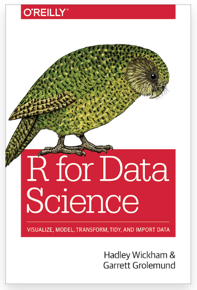

```{r setup, include=TRUE}

# this line specifies options for default options for all R Chunks
knitr::opts_chunk$set(echo=T, 
                      highlight=T)

# suppress scientific notation
options(scipen=100,
        getSymbols.warning4.0 = FALSE)

# install helper package (pacman), if needed
if (!require("pacman")) install.packages("pacman", repos = "http://lib.stat.cmu.edu/R/CRAN/")

# install and load required packages
# pacman should be first package in parentheses and then list others
pacman::p_load(pacman, tidyverse, ggthemes, magrittr, lubridate, tidyquant, highcharter,
               flexdashboard,knitr, RColorBrewer, dygraphs, gridExtra)

# verify packages (comment out in finished documents)
p_loaded()

```

---

---

### Announcements
  
- HW 5 - Part 2 isdue Wednesday 4/17


- This is the last HW Assignment and requires very little coding (Code is provided).

- You are asked to place and format chunks correctly to expand and update your dashboard as instructed.

- This assignment ALSO requires writing thoughtful responses to questions (on Blackboard) and adding text to dashboard.

<br>
  
- HW 5 - Part 2 was interoduced last week, but I provide additional review information today.

---

### Plan for Thursday and Next Week

.pull-left[

- Format and requirements for the project memos

- Project Presentation Information

- Other ways to use R/RStudio and Collaborate

- Tuesday (4/23) will be mostly an in-class work day


---

###  Requested/Selected Topics 

- This week and next week are planned as short lecture days

  - If I receive questions that are useful to all I will incorporate topics
  
  - Goal is to provide information to all students while still keeping time open for group work.


---

### Background for HW 5 - Part 2

Syracuse University is currently developing
**[Six University-wide Shared Competencies](https://effectiveness.syr.edu/shared-competencies/)**

<br>

#### **From the website:**

"Undergraduate students develop competencies through their major degree courses, liberal arts requirements, and co-curricular experiences."

<br>

#### **Overall Goal of Shared Competencies:**

- Regardless of major, when students attain their undergraduate degree, they will be competent in these six essential area.
 
- This course, **BUA 455 - Data Management for Busines**, contributes to a student's compentency in **Information Literacy and Technology Agility (ILTA)**.

---

### BUA 455 - Information Literacy and Technology Agility


- Technology Agility skills are prevalent in every assignment and task throughout the course.

<br>

- Information literacy skills are primarily addressed in HW 5 - Part 2 and in the course project.

<br>

- Essential Information Literacy Skills include 

  - Knowing how to search for information and compare data sources.

  - Attributing data sources and software

  - Comparing and evaluating different options for presenting information to determine the right choice for a specific situation.

---

### HW 5 - Part 2
  
- This assignment expands the dashboard created in HW 5 - Part 1.

- For some tasks, you are adding plots that are redundant with previous ones

  - You will be asked to compare and contrast these data visualization options.

<br>
  
### Review and New Skills for HW 5 and Project
  
#### Adding a panel to a dashboard
  
- This is straightforward but it requires careful placement of the chunk, the panel header text, and the side panel text.

- In-class Demo

---

### Skills for HW 5 - Part 2 and Project

### Adding linked text to Markdown Output
  
- This same format will work in Word, Powerpoint, Html, and Pdf output files

- Text to link goes in square brackets

- Followed by link is in round brackets

- Examples:
  
  - [R for Data Science](https://r4ds.had.co.nz/)

  - [Introduction to Data Science](https://rafalab.github.io/dsbook/)


---

### Skills for HW 5 - Part 2 and Project

#### Adding an image

- This same format will work in Word, Powerpoint, Html, and Pdf output files

- Similar to adding linked text:

  - Exclamation point followed by square brackets which can include a caption (optional)

  - Directly Followed by image file name in parentheses

  - Image file should be in `code_data_output` folder.

NOTE: You can save and export an R data visualization, and then place that figure elsewhere in the document as .png or .jpg file separate from R code.

<br>

Example of Image with caption




---

### Skills for HW 5 - Part 2 and Project

#### Adding an image in an R Chunk

- Another way to add an image is to use commands within an R Chunk

- This option may allow you to use some of the chunk options to modify sizing

- The image below is centered using the `fig.align` option and resized using the `fig.dim` option.

```{r fig.align='center', fig.dim=c(4,6)}


```


---

### Skills for HW 5 - Part 2 and Project

#### Citing sources
  
- This is not an English class so I am not particular about citation formatting

- If you are publishing in a journal, you will be required to use that journal's format.

- If you are consulting for a client or for a company, defer to the citation format they prefer.

- In this course, all citations should be formatted **consistently**. Choose one format and stick with it.

- Here is link with suggestions on [how to cite websites](https://www.citationmachine.net/apa/cite-a-website)

- Using `.qmd` templates for memos will make citing R, RStudio and R packages very straightforward. 

#### Citing R

- Type `citation()` in the R Console to see the full citation which can be copy and pasted:


` citation() `

- To cite R:

R Core Team (2024). _R: A Language and Environment for Statistical Computing_. R
  Foundation for Statistical Computing, Vienna, Austria.
  <https://www.R-project.org/>.
      
---
  
### Skills for HW 5 - Part 2 and Project

#### Citing R packages

- Type citation('package_name') in the R console.

- Replace `package_name` with name of package or package suite, e.g. `tidyverse` which is a suite of packages.


` citation('tidyverse') `

<br>

`tidyverse` suite include: 

`lubridate`  `forcats`  `stringr`  `dplyr`  `purrr`    
 
`readr`   `tidyr`  `tibble`  `ggplot2`  `tidyverse`  

<br>

To cite `tidyverse`:

To cite `tidyverse`:

Wickham H, Averick M, Bryan J, Chang W, McGowan LD, François R, Grolemund G, Hayes
  A, Henry L, Hester J, Kuhn M, Pedersen TL, Miller E, Bache SM, Müller K, Ooms J,
  Robinson D, Seidel DP, Spinu V, Takahashi K, Vaughan D, Wilke C, Woo K, Yutani H
  (2019). “Welcome to the tidyverse.” _Journal of Open Source Software_, *4*(43), 1686. doi:10.21105/joss.01686 <https://doi.org/10.21105/joss.01686>.

---

### Skills for HW 5 - Part 2 and Project

#### Citing RStudio

- type `RStudio.Version()` in the R console


`RStudio.Version()`

<br>

To cite RStudio:

Posit team (2024). RStudio: Integrated Development Environment for R. Posit
  Software, PBC, Boston, MA. URL http://www.posit.co/.


---

#### Inline R code (Required for project, not HW 5 - Part 2)

- In your projects you are asked to include inline code in the text panels

- This is a good skill to know when managing and curating data in R

- It allows you to include R objects, variables, and calculations in text

- Inline R code will automatically update when data or R code are updated.

- To use inline code:

   **`1.`** Calculate and format values in an R chunk that can be hidden using `echo = F`
   
   **`2.`** Write text in your dashboard or report using inline chunk format.
   
- This 'micro-chunk' can include a saved value, a calculation, etc..  

- The 'micro-chunk' will not appear in your output document, and it will be replaced by the output value or calculation output you specify in the chunk.

---

### R Inline Code and Example

The small chunk that follows imports a dataset and does some of the data management tasks we have covered to a dataset about yearly movie gross.

In a dashboard or report, this chunk could be hidden by including `echo = F` in the chunk header.

```{r}

# import and manage data to keep top movies from each year
bom_yr <- read_csv("bom_yearly_top_gross_2024_04_16.csv", show_col_types = F, skip=12) |>
  filter(!is.na(Releases)) |>                              # remove rows with NAs
  slice(1:15) |>                                           # keep first 15 rows
  rename("yr"="Year", "tot_gross" = "Total Gross", "num1" = "#1 Release") |>
  select(yr, tot_gross, num1) |>
  mutate(yr = as.integer(yr),
         tot_gross = gsub("$", "", tot_gross, fixed = T),
         tot_gross = as.numeric(gsub(",", "", tot_gross, fixed = T))) 

# create variables for inline code
today <- Sys.Date()                                                # saves today's date
today_fmt <- stamp("Saturday, January 1, 1999", quiet = T)(today)  # formats date
# day_updated_fmt <- 

yr_to_date_gross <- round(bom_yr$tot_gross[1]/1000000000,2)        # formats & saves 1st gross
pct_of_prev <- round(bom_yr$tot_gross[1]/bom_yr$tot_gross[2]*100)  # creates formatted ratio 

# tenyr_pp_avg <- 
# pct_of_tenyr_pp_avg <- 

```

---
  
###  R Inline Code Example


- In a polished document, the previous chunk could be hidden, by using the `echo=F` option in the chunk header.

- The document itself could have the following text which could be updated daily:

<br>

As of `r today_fmt`, the top grossing film of this year is *`r bom_yr$num1[1]`*.  

So far this year, the domestic total movie gross is `r yr_to_date_gross` billion dollars.  

This total is `r pct_of_prev`% of last year's total domestic movie gross.


---

#### In-class Exercise

 
**`1.`** In the previous chunk: 

   - Create an additional formatted date value, `day_updated_fmt` to indicate when data were updated. Data were updated on 4/16/2024, `today`.
   
   - Calculate average of total gross for the ten years before the pandemic (2010 - 2019) and save this value as an object, `tenyr_pp_avg`.
   
   - Calculate the ratio of the current gross for 2023 divided by the ten year average, format ratio as was done for `pct_of_prev`, and save this ratio as `pct_of_tenyr_pp_age`

**`2.`** Add more information to the text above, including two additional 'micro-chunks' of inline R code.  The full text section to be completed is shown below.

**`3.`** Knit your class notes (.Rmd) so that you have the final output as an html file and then save (print) it as a pdf and submit it.

  
As of `r today_fmt`, the top grossing film of this year is *`r bom_yr$num1[1]`*.     
So far this year, the domestic total movie gross is `r yr_to_date_gross` billion dollars.     
This total is `r pct_of_prev`% of last year's total domestic movie gross.

It is `_____`% of the pre-pandemic ten-year average of domestic annual gross.     
These data were last updated on `_____` and can be [accessed at this link]().    

<br>

Here is the data link: `https://www.boxofficemojo.com/year/?ref_=bo_nb_hm_secondarytab`


---

### **Key Points from Today**
  
- **Introduction of HW 5 - Part 2**

  - Due Wednesday, 4/17/24
  - Discussion of Information Literacy 
  - Explanation of Assignment Tasks
  - Review of adding linked text and images
    
- Citations
    
  - Required in Project: Citing data sources, R, RStudio, R Packages
    
  - Required in HW 5 - Part 2: Citing data sources
    
- Inline R code
    
  - Required in Project
  - Ideal for updating data information efficiently
  - In-class exercise to practice
    
<br>

You may submit an 'Engagement Question' about each lecture until midnight on the day of the lecture. **A minimum of four submissions are required during the semester.**
